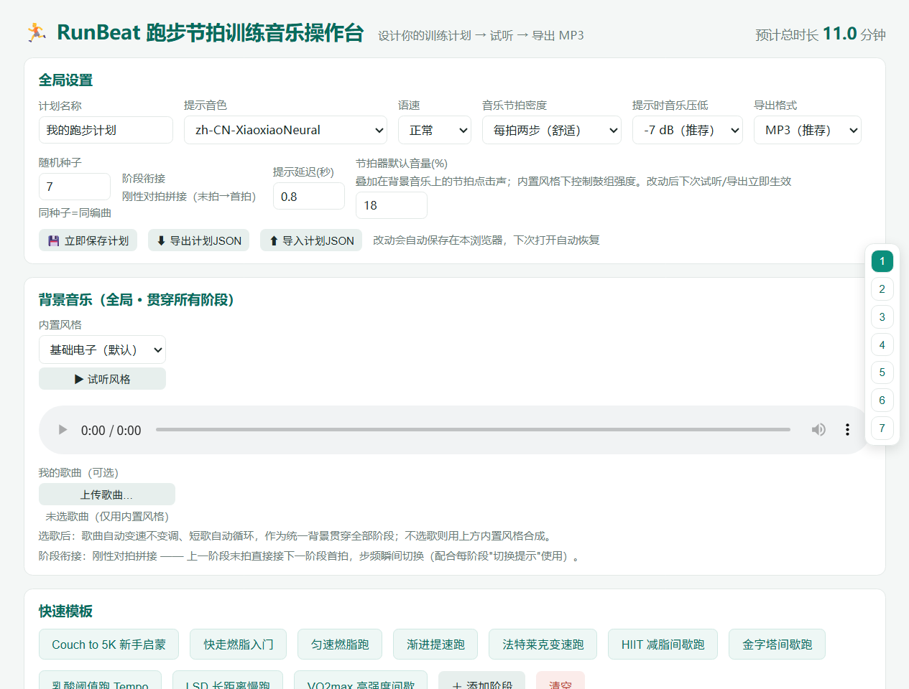

# RunBeat · 跑步节拍训练音乐生成器

> 按你自己设计的训练计划，一键生成「步频乐点精确对齐 + 中文语音提示」的跑步音频。
> 跑起来的时候，跟着音乐节奏就是你的目标步频，语音会在每个阶段切换前提前提醒你提速 / 降速——不用看表，听歌就行。

---

## 这个工具能帮你做什么？

跑步想控制速度（步频）却总跑乱？RunBeat 把这件事变成"跟着歌跑"：

- 你设计一个训练计划：热身 3 分钟、匀速跑 5 分钟、冲刺 30 秒、再慢跑 2 分钟……
- 每个阶段填一个目标**步频**（每分钟脚落地的次数，如 165 步/分钟）
- RunBeat 自动合成一段音乐：**每一步都踩在节拍上**，音乐速度精确等于你的步频
- 阶段快结束时，语音会提前提醒你"还有十秒，准备冲刺！"，衔接处节拍**无缝硬拼接**，不会打乱你的步伐
- 一键导出 MP3，放到手机里，跑步时戴上耳机就行

适合：想科学减脂 / 提升配速 / 完成 C25K 入门 / 练 HIIT 间歇的新手到进阶跑者。



---

## 📥 下载安装包

**方式一：直接下载（推荐）**
- 本仓库页面点绿色 **Code** 按钮 → **Download ZIP**，解压后双击 `启动-Windows.bat`（Windows）/ `启动-mac.command`（macOS）/ 运行 `bash 启动-Linux.sh`（Linux），浏览器会自动打开操作台
- 想下载正式发布版安装包？看仓库右侧 **Releases**，下载最新的 `runbeat-v1.25.1.zip`（约 13MB，含完整程序、内置歌曲与示例计划）

**方式二：克隆源码**

```bash
git clone https://github.com/eqline029/RunBeat.git
```

> 两种方式拿到的都是完整程序：解压/克隆后直接运行启动脚本即可，无需额外配置（首次运行会自动安装依赖）。

---

## 快速开始（3 步，小白也能装）

**第 1 步：准备 Python**

需要 **Python 3.10 或更高版本**（官网 https://www.python.org 下载，安装时勾选 "Add Python to PATH"）。
不会装？Windows 用户也可以直接双击项目里的 `安装依赖-Windows.bat`，脚本会帮你处理。

**第 2 步：一键启动**

| 你的系统 | 怎么做 |
| --- | --- |
| Windows | 双击 `启动-Windows.bat`（首次会自动安装依赖并打开浏览器） |
| macOS | 双击 `启动-mac.command`（首次在「终端」里运行，会自动装依赖） |
| Linux | 在终端运行 `bash 启动-Linux.sh` |

> 启动后浏览器会自动打开 **http://127.0.0.1:8787**，这就是操作台。
> 注意：那个弹出的**黑色窗口（终端）要一直开着**，关掉它 = 关掉程序。

**第 3 步：开始用**

在操作台里：选一个「快速模板」（比如减脂间歇跑）→ 微调阶段时长和步频 → 点「▶ 完整试听」听效果 → 点「导出 MP3」下载到手机。

> 首次生成语音需要联网（使用微软 edge-tts）；断网时会自动降级为"提示音"，不影响出片。

**先听听效果**：🎧 [示例音频：热身 → 冲刺 → 放松（2.5 分钟，含中文语音提示）](examples/runbeat-demo.mp3)（也可用 `examples/demo-plan.json` 自己重新生成）

---

## 手机也能用（同一个 Wi-Fi 就行）

1. 电脑启动操作台后，页面**底部**会显示手机使用说明，同时终端里会打印本机局域网地址（形如 `http://192.168.1.5:8787`）
2. 手机连**同一个 Wi-Fi**，用手机浏览器打开这个地址（或扫页面上的二维码）
3. 就可以在手机上配置、试听、导出下载 MP3；跑步时手机直接播放

所有数据只在你家局域网里传输，歌曲和音频**不会上传到任何服务器**。

---

## 操作台功能导览（从左到右 / 从上到下）

| 区域 | 你能做什么 |
| --- | --- |
| **计划名称** | 给这次训练起个名字（会用在导出的文件名和历史记录里） |
| **阶段列表** | 每个阶段卡片：名称、时长（支持 **分/秒双单位** 填写）、目标步频、开始提示语、结束前提前提醒；右侧有「▶ 试听」「复制」「删除」；阶段多时左侧有**全览导航**，一屏看全部、点一下就跳到对应阶段。**批量编辑**：勾选任意多个阶段后出现工具栏——统一设置（一次改相同步频/时长/提醒）、渐变设置（按顺序步频/时长等差递进，带「启用渐变」开关）、文案模板（用 {n}/{cadence}/{min}/{sec} 占位符批量生成提示语） |
| **背景音乐** | ① 内置 **15 种合成风格**（基础电子/晨光/清风/林间/柠檬气泡/云朵/溪谷/麦浪/纸飞机/水波/松风/摇滚/流行/抒情钢琴/简约轻快，每种都能试听对比）；② 可选「我的歌曲」作为**全局背景音乐**——一首歌贯穿全部阶段（不是每阶段单独选歌）；上传后可选**三种对齐模式**：变速对齐（整曲变速不变调，节拍最准）/ 原速背景（歌保持原速零失真，节拍器踩点）/ 智能对齐（拍段微调+跳补拍，接近原速又能对拍），并带原曲试听条 |
| **语音提示** | 音色（下拉已**中文化显示**，如 云希（男·少年感）、晓晓（女·温柔清晰））、语速、提示提前量、语音期间音乐压低量（duck）、节拍器音量，全局可调 |
| **随机种子** | 一个整数。**同一种子 = 同一段编曲**（想复现就记下种子）；换一个数字，音乐的和弦、节奏型就会变 |
| **快速模板** | 内置 10+ 套科学跑步课程，从**新手入门到专业大神**都有（C25K 入门、快走燃脂、匀速耐力、渐进提速、法特莱克变速、HIIT 间歇、EQ 燃脂 HIIT、金字塔间歇、节奏跑、LSD 长距离、VO2max 高强度…），鼠标悬停卡片可看课程介绍、总时长和适用水平，一键载入再微调 |
| **历史计划** | 每次导出自动记录：名称、保存时间、**时长（X 分 X 秒）**、阶段数；每行可「▶ 播放」「⭳ 下载音频」「⧉ 复制并编辑」「✎ 载入编辑」「🗑 删除」 |
| **导出区** | 「完整音频试听」（整段拼接后从头听一遍）和「导出 MP3 / WAV」，页面内直接播放、下载 |

所有配置会自动保存在浏览器里，下次打开自动恢复。

---

## 小白概念解释（30 秒看懂）

- **步频（cadence）**：每分钟两只脚落地的次数，单位 spm。新手一般 150–160，进阶 165–180，冲刺可以到 190+。
- **tempo_ratio（节拍比例）**：默认 0.5 = 音乐每 1 拍你迈 2 步（最常见跑步听感）；1.0 = 1 拍 1 步（冲刺感）。音乐 BPM = 步频 × ratio。
- **BPM**：音乐速度，每分钟多少拍。步频 165、ratio 0.5 → 音乐 BPM 82.5。
- **无缝硬拼接**：阶段切换时，前一阶段的最后一拍直接接下一阶段的第一拍（3ms 极短消音防爆音），**不是**渐弱渐强，节奏变化干脆利落，不打断脚步。
- **随机种子（seed）**：生成编曲的"配方编号"。同一种子必出同一首歌，方便复现和分享。

---

## 进阶：命令行用法（可选）

```bash
python runbeat.py serve                  # 启动操作台（同双击启动脚本）
python runbeat.py demo                    # 生成内置减脂间歇跑演示音频
python runbeat.py make 计划.json          # 按计划文件生成音频
python runbeat.py make --interactive      # 交互式设计计划并生成
python runbeat.py voices                  # 列出可用中文音色
```

手动安装依赖：`pip install -r requirements.txt`
> 「我的歌曲」对齐/解码需要系统安装 **ffmpeg**（脚本会检测并提示）；「原速背景」处理最快约 2-5 秒，「智能对齐」首次约 30-50 秒（之后秒开）。

---

## 计划文件格式（懂 JSON 的人看这里）

一个 `.json` 文件描述整个训练，操作台里的配置导出就是这个格式：

```json
{
  "title": "我的跑步计划",
  "voice": "zh-CN-YunxiNeural",
  "voice_rate": "+0%",
  "tempo_ratio": 0.5,
  "duck_db": -7,
  "cue_lead_sec": 0.8,
  "crossfade_sec": 0.0,
  "phases": [
    {
      "name": "热身",
      "duration_min": 3,
      "cadence": 150,
      "cue": "热身开始，轻松慢跑三分钟，步频一百五十",
      "pre_cue": "还有十五秒，准备进入匀速跑",
      "pre_cue_lead": 15
    }
  ]
}
```

完整示例见 `plans/fatburn_demo.json`（7 阶段减脂间歇跑，含全部提示语）。

---

## 常见问题（FAQ）

- **试听 / 导出报「Failed to fetch」？** 必须通过 http://127.0.0.1:8787 打开操作台（启动脚本会自动打开），**不要直接双击 ui.html**；并且启动用的黑色窗口要保持打开。
- **提示音盖过音乐？** 调大"语音期间压低量"（如 -10），音乐在提示时压得更低。
- **阶段衔接处有空白？** 正常版本不会——我们已经做过无缝硬拼接修复；如果你用的是旧版，请更新到 v1.18+。
- **语音提示和阶段对不上 / 提示重叠？** 请更新到 v1.15+（修复了长计划语音时间轴错位）。
- **下载的文件变成 json？** 请更新到 v1.20+（历史计划里的"下载"改为下载真实音频，并修复了音频响应类型）。
- **随机种子改了没变化？** 请更新到 v1.17+（此前种子只影响细微噪声）。
- **端口被占用？** 换端口：`python server.py 8788`。

---

## 技术架构（开发者看这里）

音乐是**程序化合成**（numpy 生成 kick / snare / hi-hat / bass / pad / arpeggio 分层），所以：
- 节拍精确到小数点，**每一步都踩在帽子上**
- 每次换随机种子得到不同编曲，无需下载任何 AI 模型

```
runbeat/
├── 启动-Windows.bat / 启动-mac.command / 启动-Linux.sh   # 三平台一键启动
├── 安装依赖-Windows.bat / 安装依赖-Linux.sh             # 一键装依赖
├── runbeat.py        # CLI 入口：计划解析 / 生成 / 启动操作台
├── server.py         # 操作台后端（局域网 + 二维码 + 音频服务）
├── ui.html           # 操作台界面（单文件，浏览器直接渲染）
├── session.py        # 会话构建：多阶段拼接 / 语音混音 / 无缝衔接
├── musicgen.py       # 程序化音乐引擎（步频 → 乐点对齐核心）
├── voice.py          # 语音提示（edge-tts + 断网提示音回退）
├── stretch.py        # 歌曲 BPM 检测（八度校正）+ 变速不变调 + 拍段智能对齐(beat-sync)
├── plans/            # 训练计划 JSON 示例
├── data/songs/       # 你在操作台上传的歌曲（仅本地）
├── data/out/         # 导出的音频文件（仅本地）
└── output/           # CLI 生成的音频与语音缓存
```

---

## 开源与许可

本项目使用 **MIT 许可证**，可自由使用、修改、商用（详见 `LICENSE` 文件）。
第三方依赖：`edge-tts`（微软语音合成）、`librosa`（音频分析/拍点检测）、`numpy/scipy`（合成）、`qrcode/pillow`（二维码）、`ffmpeg`（解码/变速对齐）。

**安全提醒**：跑步请量力而行，遵循"循序渐进"原则，身体不适立即停止；本工具输出为训练辅助音频，不构成医疗建议。

---

*RunBeat · 从"跟着节拍跑"到"跑出你自己的节拍"*
